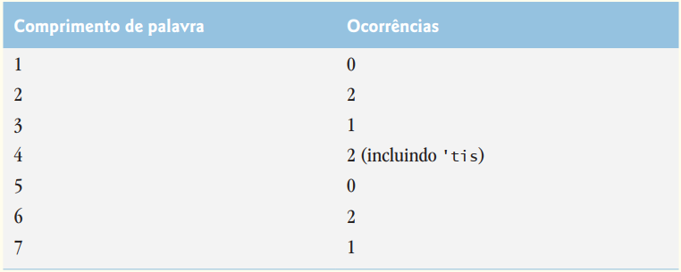

# 1418-analise-de-texto
 A disponibilidade de computadores com capacidades de manipulação de string resultou em algumas abordagens
bastante interessantes para analisar textos de grandes autores. Muita atenção foi dada à polêmica de que William Shakespeare não teria
existido de fato. Alguns acadêmicos acreditam haver evidências substanciais que indicam que Christopher Marlowe realmente escreveu as
obras-primas atribuídas a Shakespeare. Os pesquisadores têm utilizado computadores para encontrar semelhanças na escrita desses dois
autores. Esse exercício examina três métodos para analisar textos com um computador.

a) Elabore um aplicativo que lê uma linha de texto do teclado e imprime uma tabela que indica o número de ocorrências de cada letra do
alfabeto no texto. Por exemplo, a frase

To be, or not to be: that is the question:

contém um “a,” dois “b”, nenhum “c,” e assim por diante.

b) Elabore um aplicativo que lê uma linha de texto e imprime uma tabela que indique o número de palavras de uma letra, palavras de
duas letras, palavras de três letras, e assim por diante, que aparecem no texto. Por exemplo, a Figura 14.25 mostra as contagens para a
frase

Whether 'tis nobler in the mind to suffer

c) Elabore um aplicativo que lê uma linha de texto e imprime uma tabela que indica o número de ocorrências de cada palavra diferente
no texto. O aplicativo deve incluir as palavras na tabela na mesma ordem em que elas aparecem no texto. Por exemplo, as linhas

To be, or not to be: that is the question:

Whether 'tis nobler in the mind to suffer

contêm a palavra “to” três vezes, a palavra “be” duas vezes, a palavra “or” uma vez etc.

